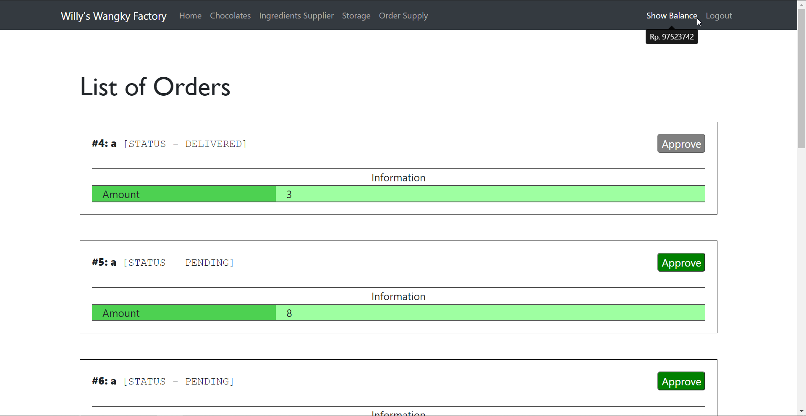
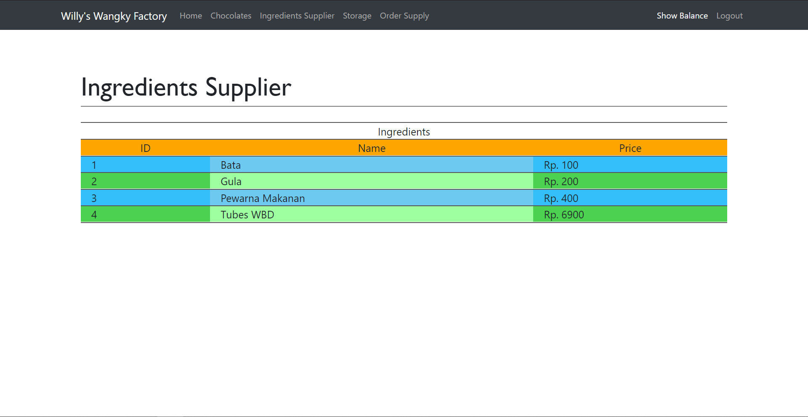
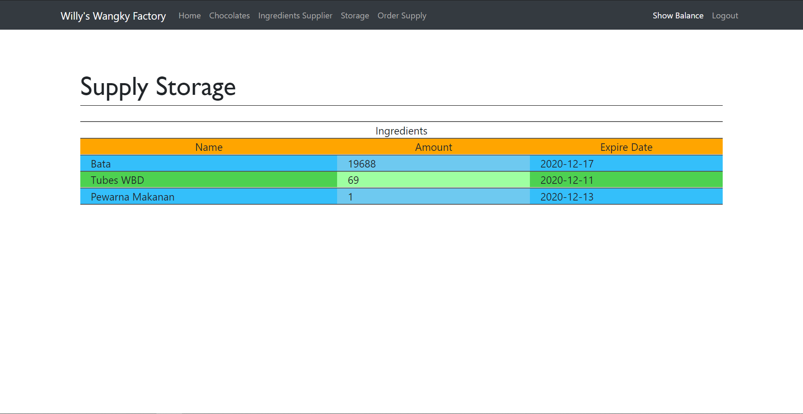
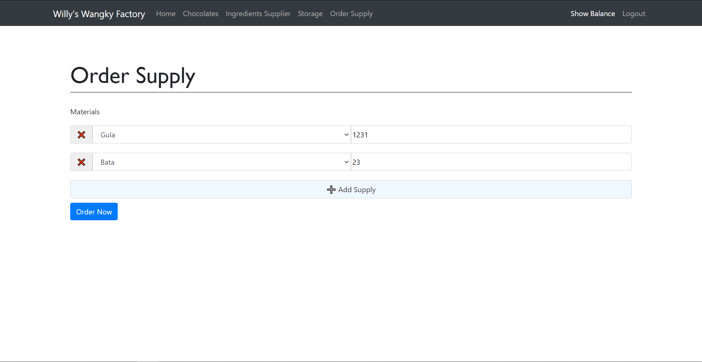

# Willy Wangky's Factory
## Description
Chocolate management front-end website using React.js.

This website can:
- Handle restock request from chocolate shop
- Resupply ingredients' stock
- Create chocolate using ingredients that're available

## Requirements
- Node.js
- WS-Supplier
- WS-Factory

## How to Use
- Run `npm install`
- Run `npm start` (for development)

## Screenshots

1. Main Page
 

2. List of Chocolates
 

3. List of Ingredients
 

4. Storage
 

5. Order Supply
 

